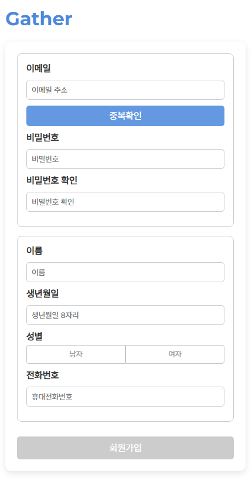
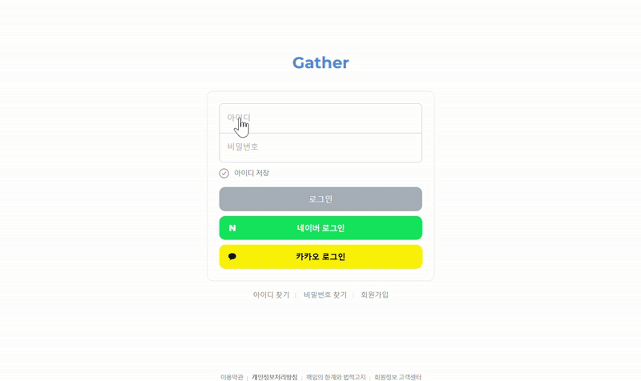
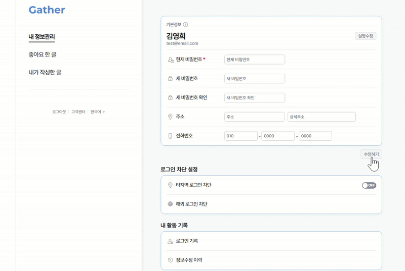

# community_project
일상을 공유하는 커뮤니티 사이트 게더(Gather)입니다.

로그인한 회원은 게시글 작성을 통해 자유롭게 의견을 나눌 수 있으며 마이페이지에서 내가 작성한 글과 좋아요를 클릭한 게시글을 확인할 수 있습니다.

## 🔧 Stack
- **Language**: JavaScript
- **Library & Framework** : Node.js(Express)
- **Database** : MySQL
- **ORM** : Sequelize

## 🔧 USE API
- 카카오 주소 API
- 카카오 공유 API
- TOAST EIDTOR UI
- Clipboard API

## 주요기능

### 회원가입
<!--  -->


- 이메일 중복 확인
- 비밀번호 특수문자 1자, 영어 대소문자 각 1자 포함 8자 이상
- 이름, 생년월일, 성별, 전화번호 저장

### 로그인


- JWT 이용
- 아이디, 비밀번호 일치 여부 체크
- 네이버, 카카오 연동 로그인 가능

### 마이페이지


- 회원만 접근 가능
- 비밀번호, 주소, 휴대폰 번호 수정
- 주소 추가(카카오 주소 API) 가능
- 회원탈퇴
- 좋아요 누른 글 목록 확인
- 내가 작성한글 확인
- 로그아웃


## ERD


## 프로젝트 구조

```markdown
project-root
├── Controller
│   ├── CategoryContoller.js
│   ├── myPageController.js
│   ├── PostContoller.js
│   ├── UserController.js
│   ├── WriteContoller.js
├── migrations
├── models
│   ├── category.js
│   ├── index.js
│   ├── like.js
│   ├── user.js
│   ├── view.js
│   ├── write.js
├── static
│   ├── css
│   ├── js
│   ├── images   
├── Routes
│   ├── DetailmainRouter.js
│   ├── myPageRouter.js
│   ├── PostRouter.js
│   ├── UserRouter.js
│   ├── WriteRouter.js
├── uploads
├── seeders
├── views
│   ├── detailmain.ejs
│   ├── findid.ejs
│   ├── footer.ejs
│   ├── header.ejs
│   ├── kakao_login.ejs
│   ├── likedpage.ejs
│   ├── login.ejs
│   ├── main.ejs
│   ├── mypage.ejs
│   ├── mypage_common.ejs
│   ├── naver_login.ejs
│   ├── post.ejs
│   ├── signup.ejs
│   ├── view_mypost.ejs
│   ├── write.ejs
├── app.js
└── package.json
```

## 👨‍💻 담당 기능

| 기능           | 담당자  |
|-------------------|------------|
| 로그인 | 최승연 |
| 네이버 로그인 API | 최승연 |
| 카카오 로그인 API | 최승연 |
| 아이디 찾기 | 최승연 |
| 회원가입 | 최승연 |
| 내 정보 수정 | 최승연 |
| 좋아요 한 글 조회 | 최승연 |
| 내가 작성한 글 조회 | 최승연 |
| 회원탈퇴 | 최승연 |
| 카테고리 별 최신글 불러오기 | 이정민 |
| 맛집 별 좋아요 높은 순으로 불러오기 | 이정민 |
| 검색 기능 | 이정민 |
| 카카오 주소 API | 이정민 |
| 카카오 공유 API | 이정민 |
| 조회수 | 이정민 |
| 좋아요 | 이정민 |
| 카테고리 별 내용 조회 | 이정민 |
| 글 쓰기 | 이정민 |
| 글 수정 | 이정민 |
| 글 삭제 | 이정민 |
| 페이지네이션 | 이정민 |
| 이미지 이동  | 이정민 |
| 조회수 | 이정민 |


## 👨‍👩‍👧‍👦 Developers
*  **이정민** ([ihoek](https://github.com/ihoek))
*  **최승연** ([werther901](https://github.com/werther901))
